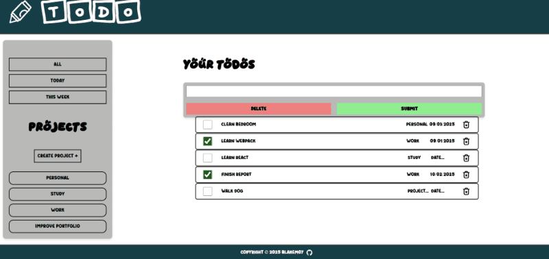

# 📝 To-Do List App with Local Storage and Project Management

A feature-rich To-Do List app that integrates **Local Storage** for persistence, supports **project management**, and includes features like due dates, and completion status management.

## 📸 Screenshots



## 🚀 Features

- ➕ **Add, Edit, Delete** tasks
- ✅ **Mark tasks as completed**
- 💼 **Manage tasks by projects**
- 📅 **Set and manage due dates**
- 🔀 **Sort tasks by due date (today, this week)**
- **Local Storage persistence** for tasks and projects
- 📂 View tasks by all, today, this week, or project

## ⚙️ Tech Stack

- **HTML** 📄
- **CSS** 🎨
- **JavaScript** ⚡

## 🚀 Live Demo

👉 [Try todo-list](https://Blakem07.github.io/todo-list/)

## 🏃‍♂️ How to Run

1. Install & Setup:

```bash
git clone https://github.com/Blakem07/todo-list.git
cd todo-list
npm install
```

2. Run

```bash
npm run dev
```

## 🛠️ Functionality

### 1. **Tasks**

- **Add Task** ➕: Create a new task by entering a title, description, due date, and priority.
- **Mark Task as Completed** ✅: Toggle completion by clicking the checkbox next to the task.
- **Delete Task** ❌: Remove tasks from the list by clicking the delete button.
- **Edit Task** 📝: Update the task title, description, priority, or due date.

### 2. **Projects**

- **Assign Tasks to Projects** 📂: Link tasks to specific projects (e.g., "Study", "Work").
- **View Tasks by Project** 🔍: Filter tasks based on the selected project.

### 3. **Due Dates**

- **Set Due Dates** 📅: Assign due dates to tasks, which will show up on the task cards.

### 4. **Filters**

- **All Tasks** 📋: Show all tasks.
- **Today’s Tasks** 🗓️: Show tasks that are due today.
- **This Week’s Tasks** 🗓️: Show tasks that are due within the week.

### 5. **Local Storage**

- **Persistence**: Tasks and projects are stored in **Local Storage**. Data persists even after refreshing the page or reopening the app.

## 💾 Local Storage Integration

The **LocalStorageManager** is used for saving and retrieving tasks from the browser's local storage.

- **Saving**: After every change (like adding or deleting a task), data is saved using `LocalStorageManager.setItem`.
- **Loading**: Upon loading the app, tasks are loaded from local storage using `LocalStorageManager.getItem`.

## 💡 Notes

- **Project Management**: The `TodoList` class can be linked with a `ProjectManager` to group tasks into specific projects. Projects can be created and tasks can be assigned to them.

## 📜 License

MIT License.

---
